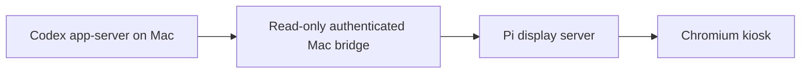

# Codex Companion MVP

An ambient Raspberry Pi companion for local Codex work. A Raspberry Pi 4B boots Raspberry Pi OS 64-bit Desktop, starts a Node.js display service, and opens a Chromium kiosk showing an animated companion plus exactly three sanitized recent Codex thread cards.

The Pi is display-only. A read-only bridge runs on the Mac, starts `codex app-server`, calls the supported `thread/list` method, and exposes an allowlisted snapshot containing only an opaque id, title, short preview, timestamp, and safe status. It never scrapes ChatGPT, copies browser credentials, sends turns or tool calls, or mutates threads.

## Architecture



The default deployment target is a Pi named `codex-companion.local`, using SSH user `admin`, on the same trusted home network as the Mac. The kiosk is designed for a small landscape display; verification uses a 1024x600 viewport. The layout also adapts to portrait and larger screens.

## What it shows

- Idle, active, waiting-for-approval, and offline companion animations.
- Exactly three cards, padded with safe empty cards when fewer than three threads exist.
- Sanitized title, preview, relative timestamp, and status.
- Cached last-known activity while the Mac bridge is temporarily unavailable.
- No touch actions: v0.1 is informational and read-only.

## Local preview and tests

Requires Node.js 18 or newer. Runtime dependencies are Node built-ins only.

```bash
npm test
npm run verify
MOCK_MODE=1 npm run dev:pi
```

Open <http://127.0.0.1:4173> for the mock kiosk. `npm run verify` also checks JavaScript and shell syntax and required deployment files.

## Mac bridge

The bridge requires a strong token stored in a local file with mode `0600`. The installer creates one if it does not already exist and never prints it:

```bash
./scripts/install-mac.sh
```

The default token path is `~/Library/Application Support/CodexCompanion/bridge.token`. The LaunchAgent is `com.aublet.codex-companion-bridge`; logs are under `~/Library/Logs/CodexCompanion/`. The bridge listens on port `4174` and exposes an unauthenticated health check plus an authenticated `/api/threads` endpoint.

Find the Mac hostname with `scutil --get LocalHostName`; the Pi bridge URL is normally `http://NAME.local:4174`.

## Raspberry Pi installation

The repository must be readable by the Pi updater. For a public repository:

1. Copy the Mac token file to the Pi through an interactive `scp` session, without printing it.
2. Run the installer from a checkout on the Pi:

```bash
sudo ./scripts/install-pi.sh \
  --repo https://github.com/emileaublet/codex-companion-rpi.git \
  --bridge-url http://YOUR-MAC.local:4174 \
  --token-file /path/to/copied/bridge.token \
  --user admin
```

The installer stores the token at `/etc/codex-companion/bridge.token`, owned by `admin` with mode `0600`; it does not echo the token. It installs the display systemd service, the 15-minute update timer, and the Desktop autostart entry for Chromium kiosk mode.

The Pi service listens only on `127.0.0.1:4173`; Chromium accesses it locally. The bridge connection leaves the Pi and therefore requires the strong bearer token.

## Updates

The updater checks the configured GitHub branch every 15 minutes. It clones a fresh snapshot into a temporary release directory, runs strict Git validation plus the full verification suite, then switches the `current` symlink atomically. The active service is restarted only after activation. Previous releases remain available for rollback. A reboot occurs only when an activated release contains `deploy/REBOOT_REQUIRED`.

The Pi does not use a personal GitHub access token. Private repositories require a repository-scoped read-only deploy key configured separately; do not put that key or any personal token in the Pi image.

## Security boundaries

- The bridge is read-only and invokes only `initialize`, `initialized`, and `thread/list`.
- Browser JavaScript receives only sanitized allowlisted fields.
- Control characters, terminal escapes, HTML tags, absolute paths, and credential-shaped values are removed or redacted.
- Tokens are never committed, embedded in the kiosk, logged, or returned by APIs.
- HTTP is suitable only for the stated trusted-home-network MVP; use TLS or a private overlay network for untrusted networks.

## Repository

<https://github.com/emileaublet/codex-companion-rpi>
